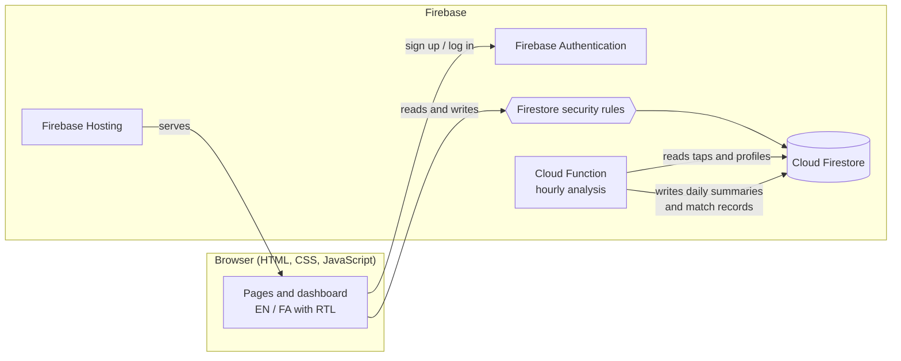

# Del Be Del

A bilingual (English and Persian) web platform that tests an old Persian saying, *"del be del rah dare"*: roughly, "hearts are connected". Users record the moments someone crosses their mind, and the platform checks whether two people thought of each other at nearly the same time, without either being notified in real time.

> **Status:** deployed on Firebase and in testing with test accounts.

## How It Works

1. Register with a unique username and share it with people you want to connect with.
2. Add connections by searching for their username.
3. Tap the heart next to a connection whenever they cross your mind. Nothing is sent to them.
4. Every hour, a scheduled Cloud Function pairs taps between connections. When two people tap each other within **10 minutes**, it counts as a match.
5. Each user sees a daily summary in their own local time: who thought of them, how often, and any matches.

## Features

- **Bilingual interface** with full right-to-left layout for Persian, switchable at any time.
- **Per-user time zones:** each person's "day" follows their local midnight, so a summary for someone in Toronto and one for someone in Tehran both cover their own calendar day.
- **Server-enforced rules:** a 3-minute cooldown between taps to the same person, server-set timestamps, and validated usernames and display names, all enforced by Firestore security rules rather than the browser.
- **Pseudonymous research records** of matches (user IDs and times only, no names), kept separate from user data and closed to all client access.

## Architecture



The browser never writes summaries or research data. The Cloud Function uses the Admin SDK, and derives every username and timezone from server-side profiles rather than from fields the client supplies.

### Data Model

| Collection | Contents | Access |
|---|---|---|
| `users/{uid}` | Display name, username, email, timezone | Owner only |
| `users/{uid}/tapsSent` | Target uid and server timestamp | Owner creates and reads |
| `users/{uid}/tapCooldowns` | Last tap time per connection | Owner; enforces the 3-minute cooldown |
| `users/{uid}/dailySummary/{date}` | Taps sent and received, who tapped, matches | Owner reads; written by the Cloud Function |
| `usernames/{username}` | uid and display name | Signed-in users read (for search) |
| `connections/{fromUid_toUid}` | A one-way connection | Creator and target read; creator deletes |
| `research/matches/records` | Match times and gaps between two uids | No client access |

## Security

The Firestore rules are the security boundary, since the client code runs in the user's browser. They enforce:

- **Ownership:** each user can claim exactly one username, pointing to their own account, created together with their profile.
- **Integrity:** tap and account timestamps must be the server time, so taps cannot be backdated to fake a match.
- **Rate limiting:** a tap is only accepted if the per-connection cooldown document advances in the same write, at least 3 minutes after the previous tap.
- **Validation:** usernames, display names and timezones are checked for format and length, and documents cannot carry extra fields.

In the browser, all user-supplied text is escaped before rendering, and no user data is placed inside inline event handlers.

The rules are covered by an automated test suite that runs against the Firestore emulator on every pull request.

## Research Data and Privacy

The platform stores when each tap happens and who it was directed at. Match records for research keep only the two user IDs, the tap times and the gap between them. A consent screen and privacy notice are planned before the platform opens beyond test accounts.

## Tech Stack

JavaScript · HTML/CSS · Firebase (Hosting, Authentication, Cloud Firestore, Cloud Functions for Node.js 22) · Node.js test runner · GitHub Actions

## Project Structure

```
├── code/                     # static site served by Firebase Hosting
│   ├── js/                   # auth, dashboard, profile, i18n, Firebase config
│   ├── lang/                 # en.json, fa.json
│   └── css/
├── functions/
│   ├── analysis.js           # matching and per-timezone summaries (pure, unit-tested)
│   ├── index.js              # scheduled Cloud Function
│   └── test/
├── tests/                    # Firestore security rules tests
├── firestore.rules
├── firestore.indexes.json
└── firebase.json
```

## Running Locally

Requires Node.js 22 and Java 21 (for the Firebase emulators).

```bash
npm install
npm --prefix functions install
npm run serve          # Auth, Firestore, Functions and Hosting emulators
```

Open http://localhost:5000. On `localhost`, the site connects to the emulators instead of the live project, so local testing never touches real data. The emulator UI is at http://localhost:4000.

## Testing

```bash
npm run test:functions   # matching and timezone logic
npm run test:rules       # security rules, against the Firestore emulator
```

## Deployment

```bash
npx firebase login
npm run deploy           # hosting, Firestore rules and indexes, functions
```

The web API key in `code/js/firebase-config.js` identifies the Firebase project and is not a secret. Access is controlled by the security rules. The key should still be restricted to the project's domains in Google Cloud Console.

## License

[MIT](LICENSE)
